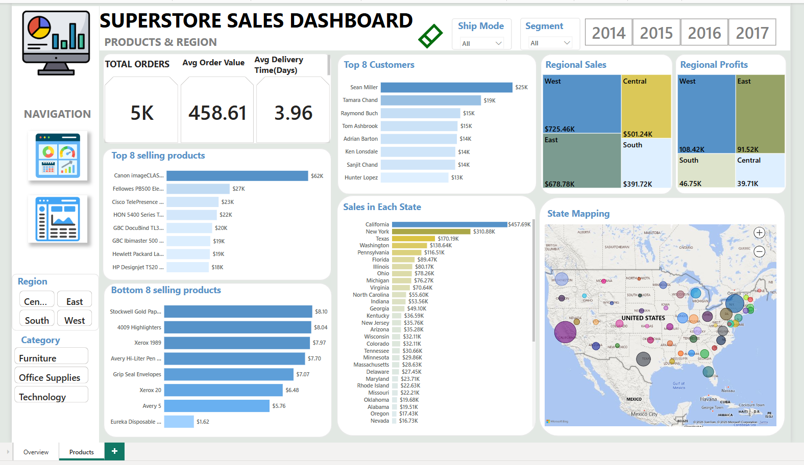
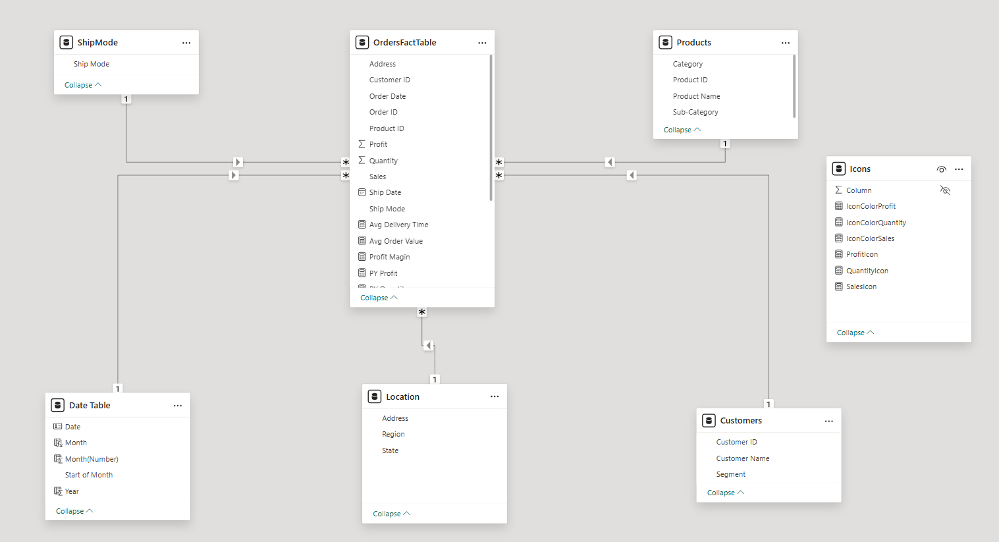

# KPI-Dashboard-in-Power-BI (UK Superstore Sales (2014-2017))

## Project Overview
Developed an interactive Power BI dashboard to analyze sales performance for a US Superstore dataset (9,995 transactions, 2014–2017). The dashboard features key metrics, including Total Sales, Profit Margin, Average Order Value, and Average Delivery Days, with year-over-year comparisons (CY vs. PY). Enhanced with custom KPI visuals, and image-based status icons (green up/red down arrows) to highlight performance trends. Utilized DAX for advanced calculations and optimized visuals for actionable insights into sales, profitability, and operational efficiency by region and product category.

## About the Dataset
The dataset consists of:
- 21 columns
- 9,995 rows
- Covers sales data from 2014 to 2017 The dataset includes details like Order Date, Ship Date, Customer Name, Product Category, Sales, Profit, Discount, Quantity, Order ID, Region and others.

  ## Business Questions
1. How has sales performance changed from 2014 to 2017?
2. Which product categories are bringing in the most revenue?
3. Who are our top customers, and how much are they contributing?
4. Which regions are performing best in terms of sales and profit?
5. What shipping mode do most customers prefer?

## Visualizations
 

## Data Model

## Key Takeaways & Recommendations
1. Stock Up on Best-Selling Items – Phones and Chairs are driving a lot of revenue. Make sure there’s enough inventory.
2. Optimize Order Fulfillment – Reducing shipping time can improve customer experience.
3. Expand in High-Growth Regions – The West and South regions are performing well; consider increasing marketing efforts there.
4. Loyalty Program for Top Customers – Offering exclusive deals can keep them engaged.

- ✅ Created by: **Morris Musyoki**
- ✅ Built with: **Microsoft Power BI**
- ✅ Dataset: **US Superstore Sales (2014-2017)**
